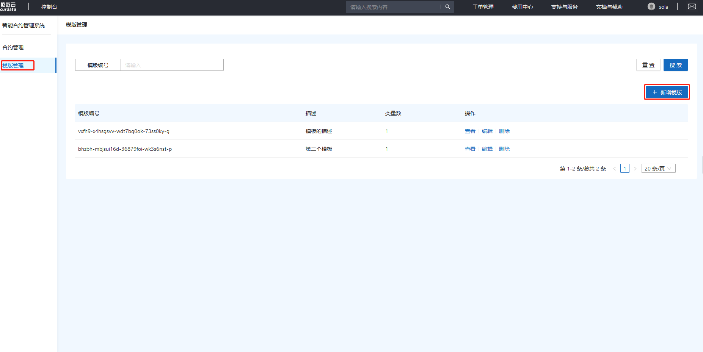
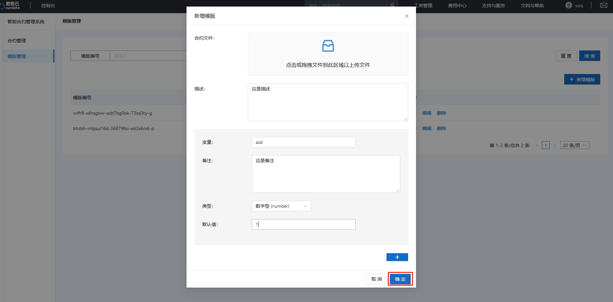
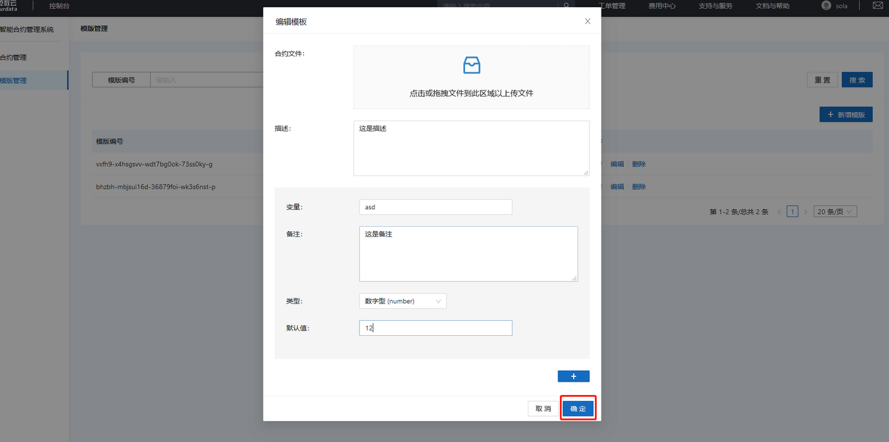
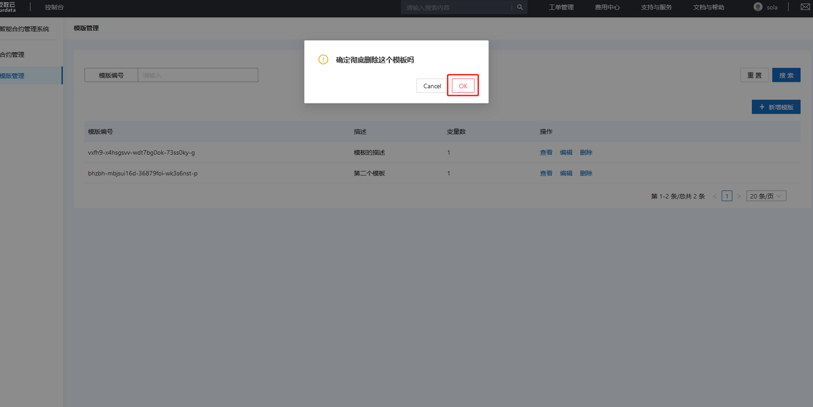

## 快速入门

### 合约管理

合约管理中记录着合约的基本信息包括：

执行编号：该合约的唯一执行编码

货币编号：该合约所属的货币唯一识别码

代码长度：该合约的代码长多少字节

执行时间：该合约从何时开始执行

消耗时间：该合约执行消耗的时间

合约状态：该合约当前的状态（执行中、已完成）

执行结果：该合约执行后的结果（执行成功、执行失败）

用户可以通过搜索功能来搜索需要查看的合约。

### 新增模板

点击并进入“模板管理”模块

点击右侧“新增模板”按钮

填写相关参数（变量、描述、类型、默认值）点击”+“按钮可添加多个变量

模板各参数介绍：

合约文件：可直接导入模板文件

描述：对整个模板的描述

变量：模板包括哪些变量，可添加多个

备注:   对这个变量的备注

类型：模板类型包括 数字型、布尔型、字符型、列表框、加密串

默认值：设置模板的默认值

可以拖拽合约文件直接从外部导入合约模板

点击“确定”按钮

生成成功

### 查看模板

点击右侧“查看”按钮

进入模板详情页可查看（变量、描述、类型、默认值）

点击“确定”按钮

编辑成功

### 编辑模板

点击右侧“编辑”按钮

相关相关参数（变量、描述、类型、默认值）

点击“确定”按钮

编辑成功

### 删除模板

点击右侧“删除”按钮

点击提示弹窗的“确定”按钮

删除成功

