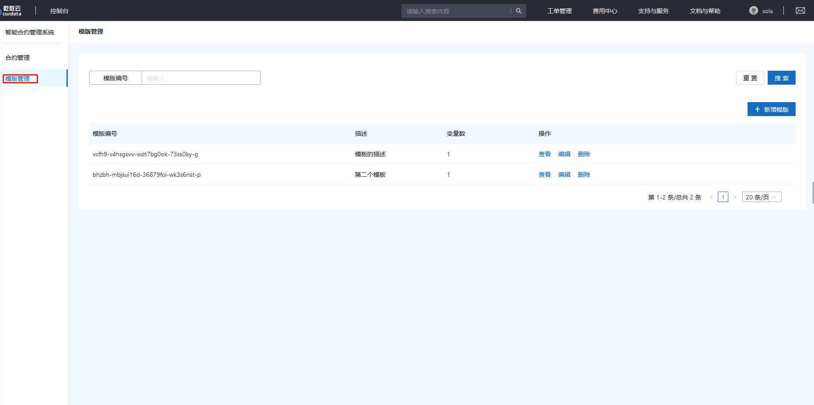

# 云端合约引擎

CSCE是为数字货币提供基于数字货币智能合约开发的重要工具组件，帮助开发者实现基于DCEP的智能合约功能。整个云端合约引擎提供了一套生成数字货币智能合约的工具链与开发环境，开发者可以上传智能合约，云端智能合约引擎会根据运行环境选择合约的运行位置，辅助开发者快速的实现基于数字货币的智能合约功能。

模拟货币生成系统具有如下特性：

- 合约生成

  提供基于用户开发合约模板动态生成智能合约的功能，辅助开发者快速生成所需的智能合约。

- 托管运行

  根据合约执行策略，CSCE会将合约在云端执行，并将执行后的结果自动与数字货币钱包同步。

- 合约分发

  CSCE会根据交易的情况，自动的向交易相关的数字货币钱包分发智能合约。

## 功能介绍

### 1.合约管理

该模块负责管理系统中的智能合约信息。可通过合约信息搜索符合条件的智能合约。

### 2.模板管理

该模块负责新增并管理智能合约模板。可查看模板详情或编辑（删除）模板。

