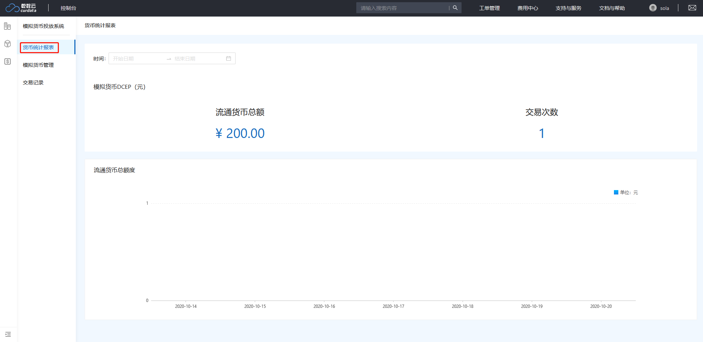
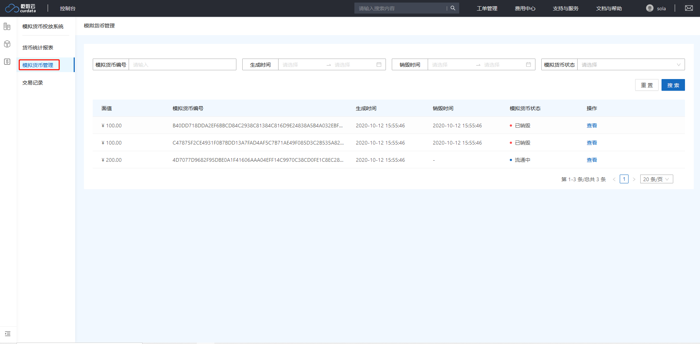
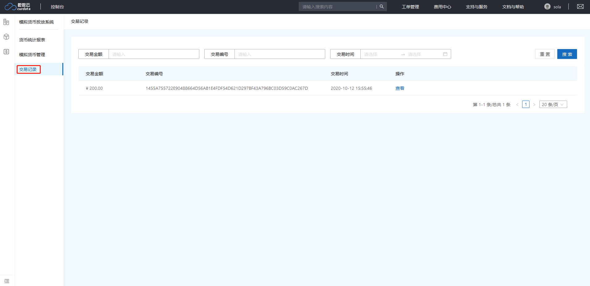

# 模拟货币投放系统

模拟货币投放系统（DCDS）是进行数字货币模拟开发测试的重要工具组件，是完成模拟数字货币交易的重要步骤。利用模拟货币投放系统，用户可以提前开发DCEP的交易流通过程，使用测试货币进行技术验证。DCDS会提供统一且简单易用的接口，使得用户无需考虑对接模拟DCEP系统中可能会出现的复杂情况，降低企业的开发成本。

模拟货币生成系统具有如下特性：

- 精准模拟

  依照央行对法定数字货币的技术规范和公开信息开发，模拟化实现了DCEP的技术特征，可以精确模拟出用于企业技术开发测试的货币数据。

- 标准统一

  提供了一套统一且通用化的DCEP投放API，无需考虑后续真实环境中不同DCEP投放系统可能会存在的差异。

- 快速对接

  模拟货币生成系统提供了一套更标准化的API，在技术上对未来真实环境作出兼容性适配，方便开发者快速的接入。未来在央行公开发行DCEP后，可以快速对接正式环境，无需重新开发。

- 全线兼容

  方便与乾数云平台上其他产品进行兼容，便于开发者快速接入多样化的云产品实现复杂的功能。

功能介绍：

货币统计报表：

该模块统计并显示模拟系统在一段时间内所流通的模拟货币及交易信息，可通过时间搜索来显示相应统计信息。

2.模拟货币管理：

该模块负责管理模拟系统中流通的模拟数字货币信息。可通过货币信息搜索符合条件的模拟货币。

3.交易记录：

该模块负责管理模拟系统中产生的交易信息。可通过交易信息搜索符合条件的交易。

