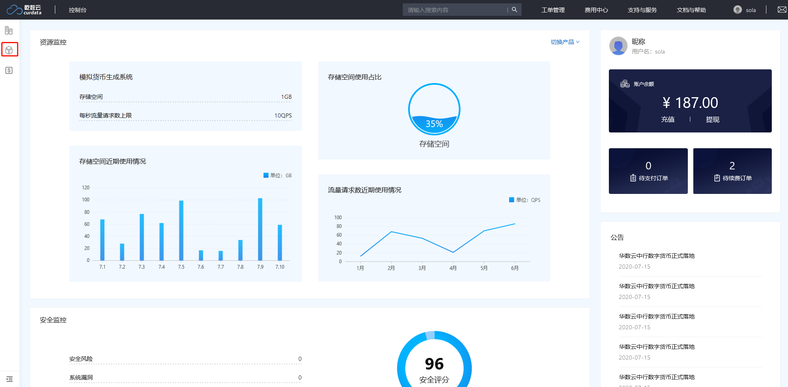
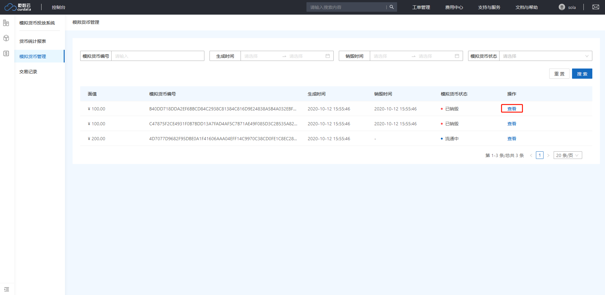
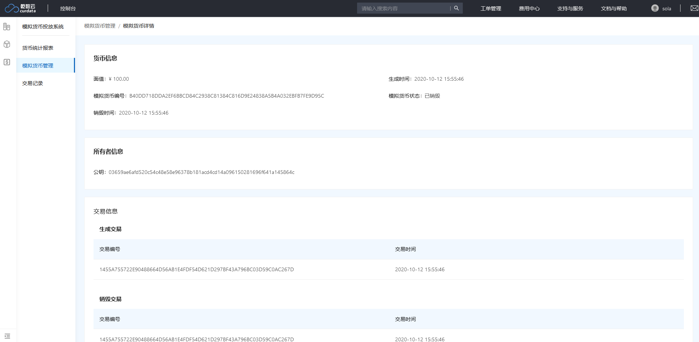
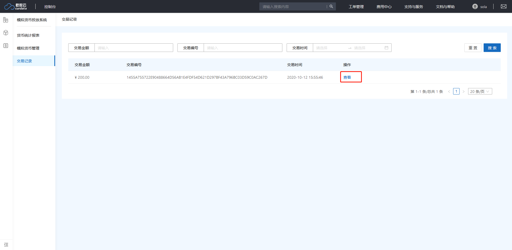
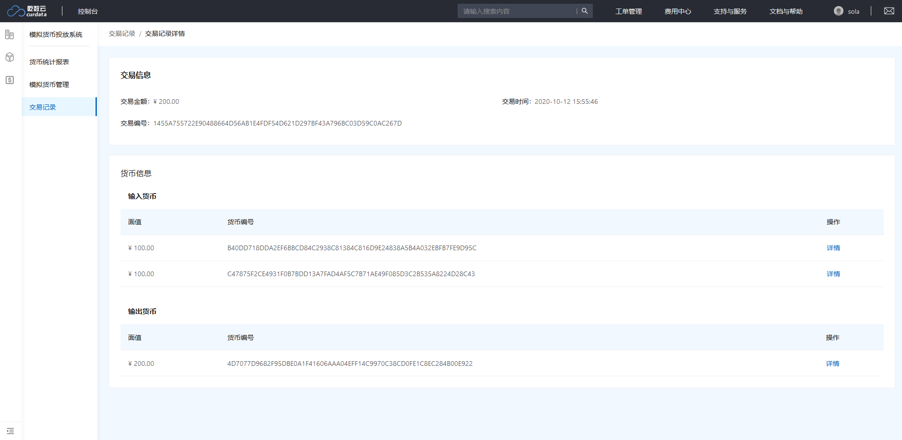

# 快速入门

如何进入产品：点击控制台中左侧导航栏进入模拟货币投放系统

## 使用流程

### 查看货币信息

1. 点击并计入“模拟货币管理”模块
2. 点击货币列表中操作类的“查看”按钮

货币详情包括货币信息、所有者信息、交易信息

1. 货币信息记录货币的基本信息，比如面值、生成时间、货币编号、货币状态等。

2. 所有者信息记录当前持有这张货币的个人信息，比如公钥及其他个人信息。

3. 交易信息记录这张货币所参与的交易信息，比如生成交易和销毁交易

备注：任意一张货币如果仍在流通中则只有生成交易没有销毁交易。

### 查看交易信息

1. 点击并计入“交易记录”模块
2. 点击交易列表中操作类的“查看”按钮

交易详情包括交易信息和货币信息

交易信息记录这笔交易的基本信息，比如交易金额、交易时间、交易编号等。

货币信息记录这笔交易中所参与的货币，包括输入货币及输出货币。

备注：交易时会根据交易需要将钱包中的一些货币销毁作为输入货币，生成新的货币作为输出货币。

> 备注：可以在交易记录详情中查看相应货币信息