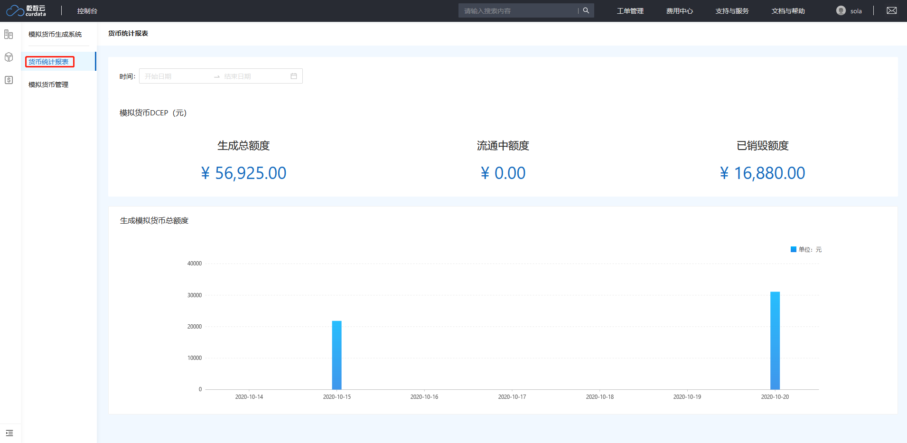
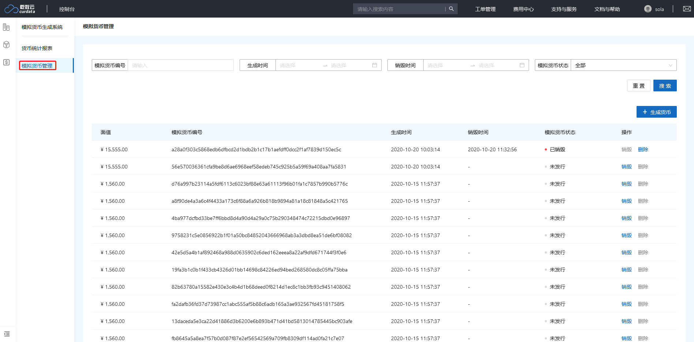

# 模拟货币生成系统

模拟货币生成系统（DCGS）是进行数字货币模拟开发测试的重要工具组件，帮助开发者生成并获取模拟的DCEP测试货币。利用生成的模拟货币，用户可以提前对DCEP的特性进行了解，并能在模拟货币的基础上进行开发，提前对DCEP货币的特征进行分析与测试，方便后续接入正式的环境，对数据进行分析。模拟货币数据并不代表真实货币，仅提供与法定数字货币相似的技术特征用于技术开发环节，不具备购买力。

模拟货币生成系统具有如下特性：

- 精准模拟

  基于央行DCEP相关专利进行设计，对央行DCEP专利所描述的内容进行模拟实现，保证了DCEP模拟的精确性。

- 特征完整

  完整的展现了DCEP货币的各种特征与特点，方便用户对DCEP的特性进行了解。

- 快速对接

  模拟货币生成系统提供了一套更标准化的API，方便开发者快速的接入。未来可以快速对接正式的DCEP环境而无需重新开发。

- 全线兼容

  方便与乾数云平台上其他产品进行兼容，便于开发者快速接入多样化的云产品实现复杂的功能。

## 功能介绍

### 1.货币统计报表

该模块统计并显示模拟系统在一段时间内所生成的模拟货币信息，可通过时间搜索来显示相应统计信息。

### 2.模拟货币管理

该模块负责生成并管理模拟系统中生成的模拟数字货币。可通过货币信息搜索符合条件的模拟货币。

