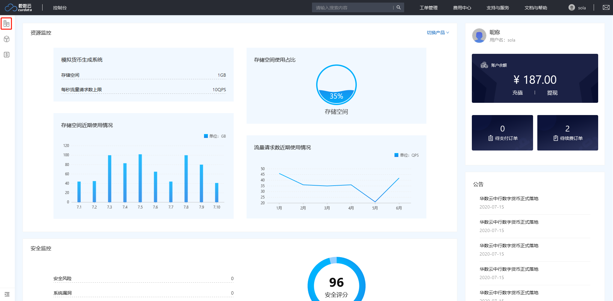
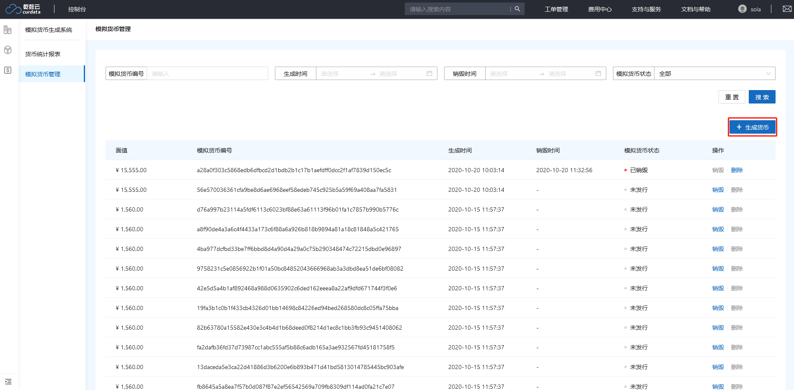
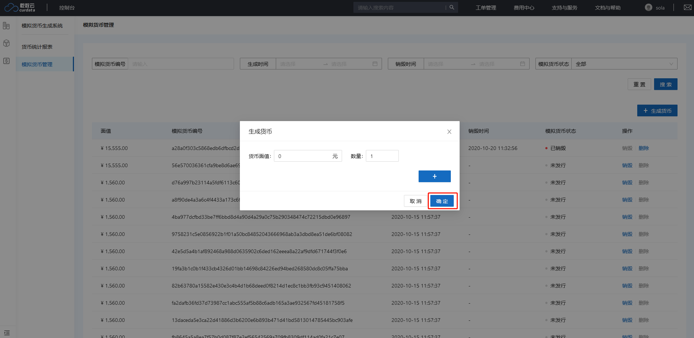
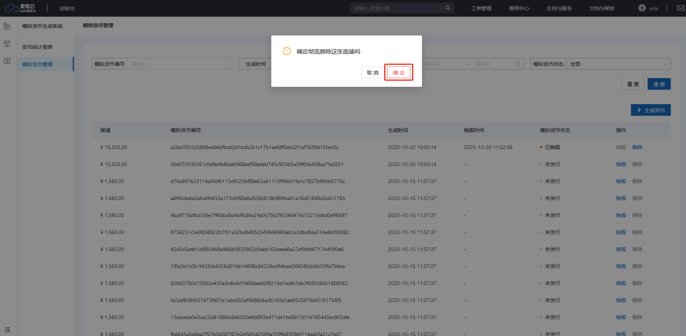

# 快速入门

如何进入产品：点击控制台中左侧导航栏进入模拟货币生成系统

## 使用流程

### 生成货币

1. 点击并计入“模拟货币管理”模块
2. 点击右侧“生成货币”按钮
3. 填写需生成的货币面值及数量（可添加多种不同面值货币）
4. 点击“确定”按钮
5. 生成成功

### 销毁货币

> 备注：只有未发行的货币才能被销毁

1. 点击货币列表中操作类的“销毁”按钮
2. 在提示弹窗中点击“确定”按钮
3. 销毁成功

### 删除货币

> 备注：只有被销毁的货币才能被删除

1. 点击货币列表中操作类的“删除”按钮
2. 在提示弹窗中点击“确定”按钮
3. 删除成功

